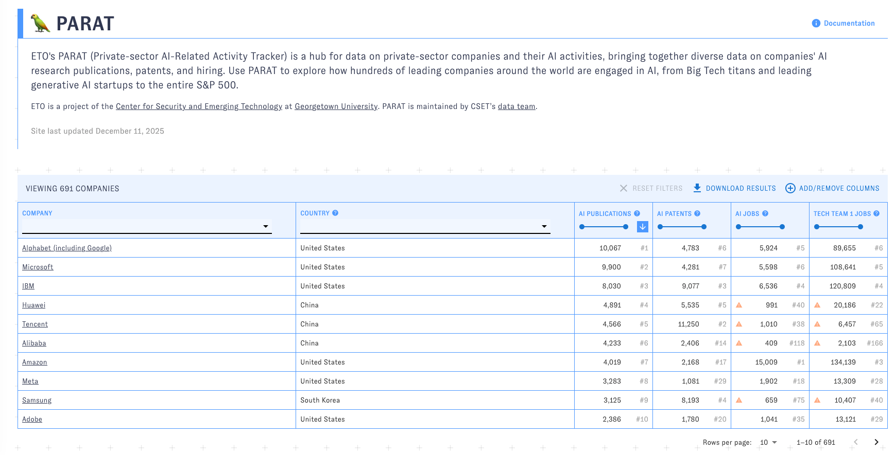
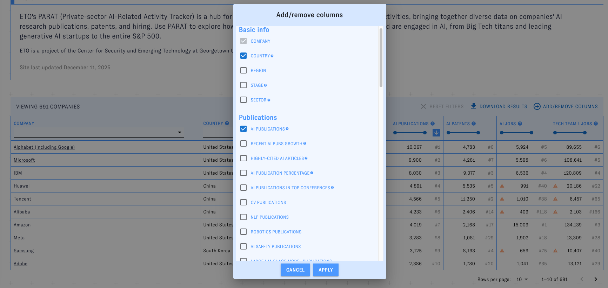
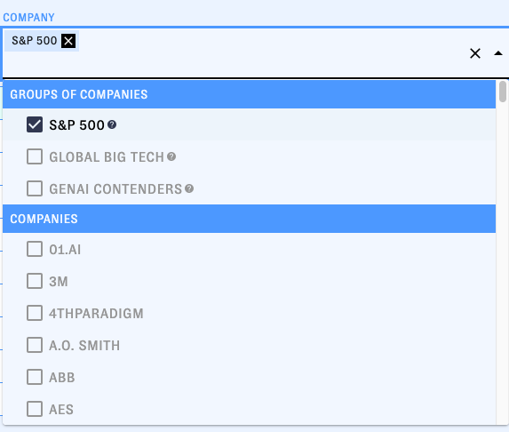
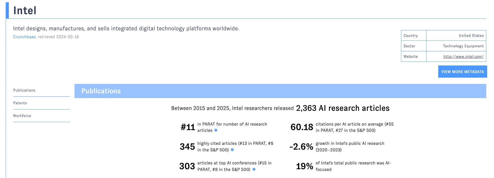
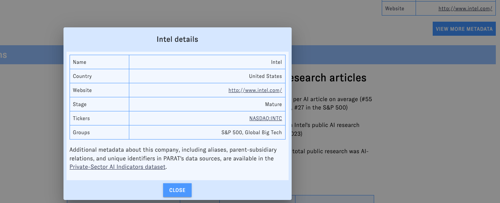
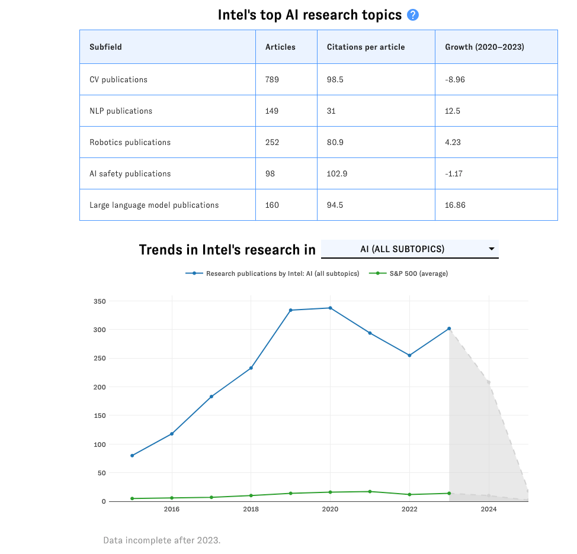
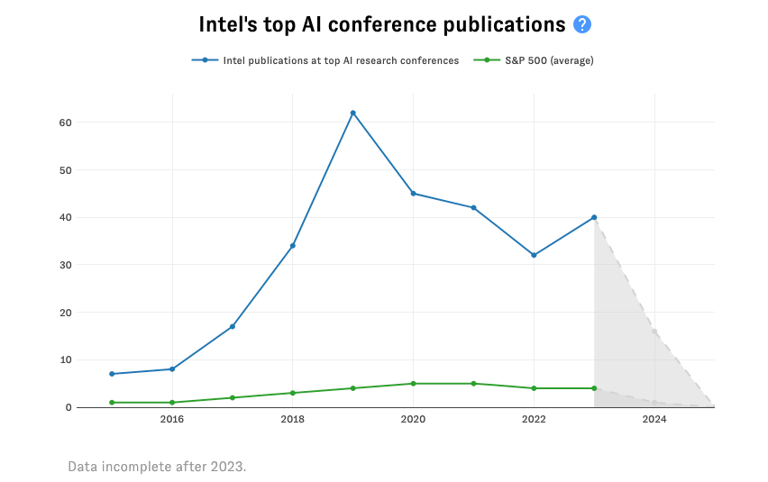
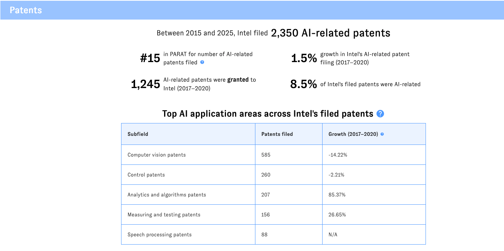
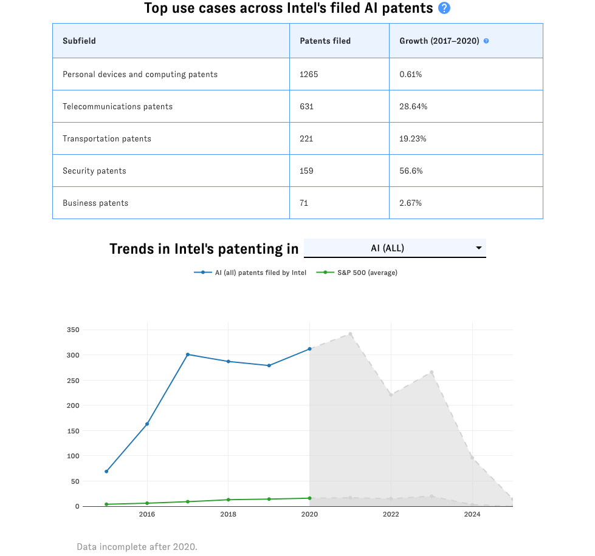
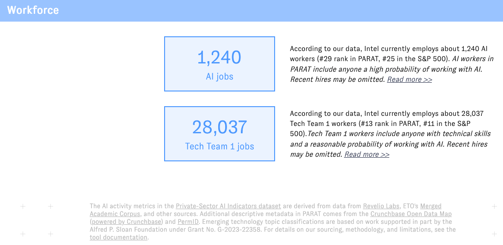

# Web artifacts and data preprocessing code for PARAT

This directory contains the code that processes the data generated in [company_linkage](../company_linkage) for use in the PARAT website. It also contains a Gatsby project (`gui-v2`) that implements the PARAT website.

## Pulling data from BigQuery 

To populate the necessary data from a raw clone of this repository:

1. `export GOOGLE_APPLICATION_CREDENTIALS=<path to a service account with translation
and BigQuery reader permissions>`. 
1. If you want to refresh sector information, `export PERMID_API_KEY=<api key here>`. You can find an API key in [GCP secret manager](https://console.cloud.google.com/security/secret-manager/secret/permid_api_key/versions?inv=1).
1. To fully regenerate everything including images and Google Finance links 
(which take ~1.5 hours to generate), run: 
`python3 scripts/retrieve_data.py --refresh_raw --refresh_images --refresh_market_links --refresh_sector`. Run
`python3 scripts/retrieve_data.py -h` for more detail on what these parameters do.
1. The `retrieve_data.py` script will also generate a new data zipfile for Zenodo. You can add this to [10.5281/zenodo.12520759](https://doi.org/10.5281/zenodo.12520759). Please provide a semantic version string.

## Web interface

The new (v2) interface for PARAT is in the `gui-v2/` directory. To update the tooltips, edit `gui-v2/src/static_data/tooltips.js`.

### Development server
To start the development server:

```bash
cd gui-v2/
npm install
npm run develop
```

The PARAT v2 interface will be available at `localhost:8550`.

### Deploying release

When any changes are ready for deployment, do:

```bash
npm install
gatsby clean
gatsby build
```

And check that everything looks like you expect. Then, copy the files in the resulting `public` directory to the production GCS bucket using `bash push_to_production.sh`. This script currently rebuilds the site - you can omit the build steps if you've already run them manually.

The script will also update and push the tags for the just-deployed version
(`deploy/current`) and the previously-deployed version (`deploy/previous`) to
help track changes.

### Tooltips

Tooltips are defined in [`src/static_data/tooltips.js`](https://github.com/georgetown-cset/parat/blob/master/web/gui-v2/src/static_data/tooltips.js),
and can include React fragments and Emotion styles for design and layout.

Tooltips use the same keys as their associated data elements (example: S&P 500
data uses the `sp500` key, as does the S&P 500 explainer tooltip).

### Interface and Use

As PARAT is no longer available, we are providing some screenshots and explanations of what is generated by this code.

The main page shows a list of companies and information about AI activity by those companies in associated columns. The columns are sortable and filterable, and the list can be paged through:



Additional columns can be added or removed from the main page view:



Filters allow selecting individual elements from columns or even selected groups:



Selecting a company will bring you to a detail view for that organization:



Here, you have the opportunity to view more metadata:



Or to learn more about the company's AI activity. This includes further detailed information about the company's AI research activities:




About their AI patenting:




And about their AI workforce:



The tool also allowed for downloading filtered results.